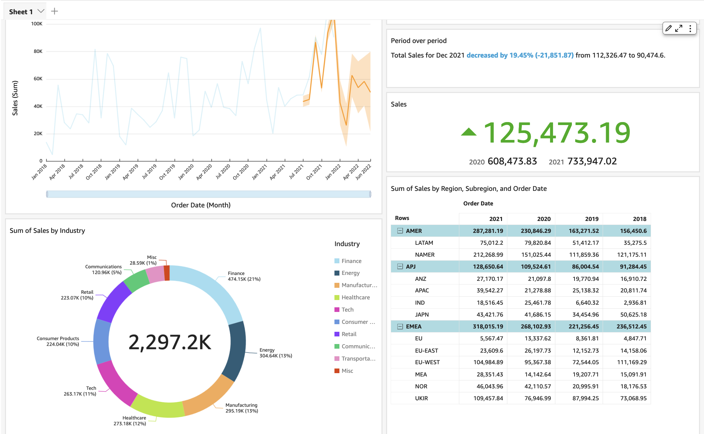
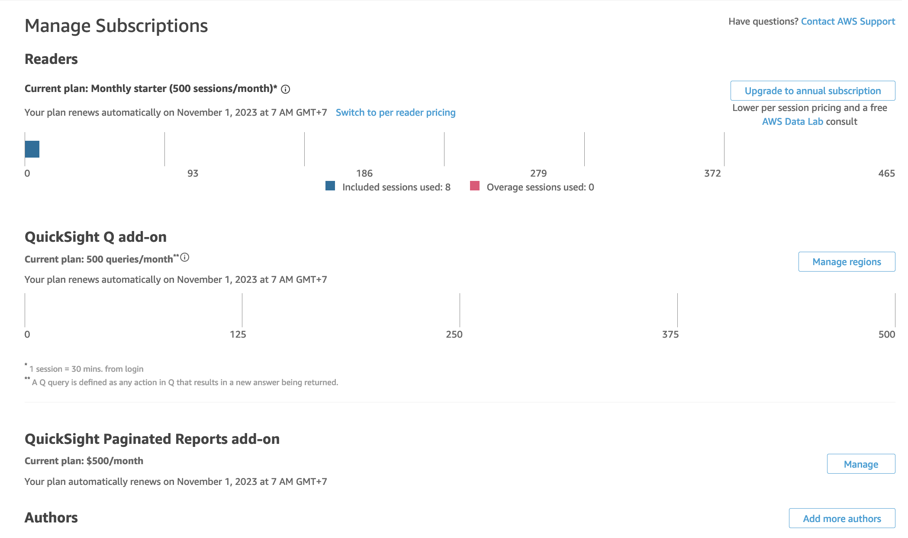

## Create a Dashboard

- Upload data
- Walk through basic things: Visual, Field, Theme, Filter, Forcast
- Author, Admin, Reader
- Pricing and sessions

Following these steps to create a dashboard

- Add line chart with sale and order date
- Add forcast to the line chart forward 6 and backward 6
- Add donut chart with sale and industry
- Add drill down by drag customer to under the industry
- Add an insight with sale and order date then modify the visual
- Select the line chart then add insight (suggested month over month change)
- Select the line chart then add suggested forcast (ML)
- Select the line chart and add filter by segment (All applicable visual)

## Create User

Goto Manage QuickSight, then Manage users

- Invite or create a new user
- Check invitation email
- Login by this link [HERE](https://quicksight.aws.amazon.com/sn/auth/signin?)

## Publish Dashboard

- Share with a QuickSight reader

- Share public available

To share a dashboard publicly accessiable to the internet we have to turn on session capacity pricing[HERE](https://docs.aws.amazon.com/quicksight/latest/user/share-a-dashboard-grant-access-anyone.html)

## Embed Dashboard

- 1-click embed enterprise
- 1-click embed pubic accessiable
