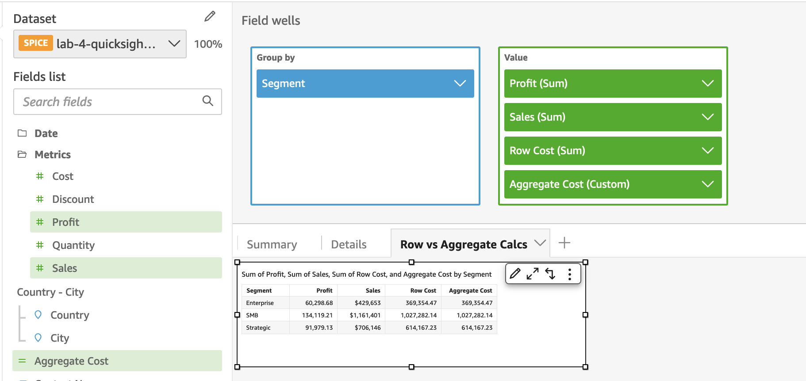
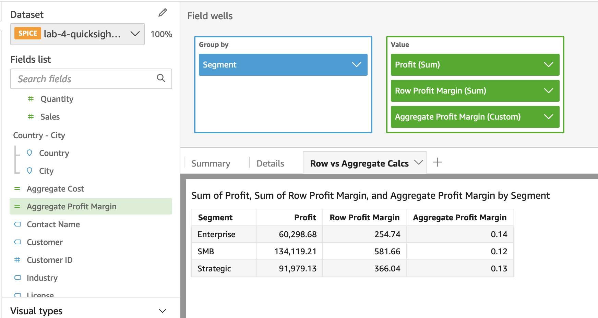
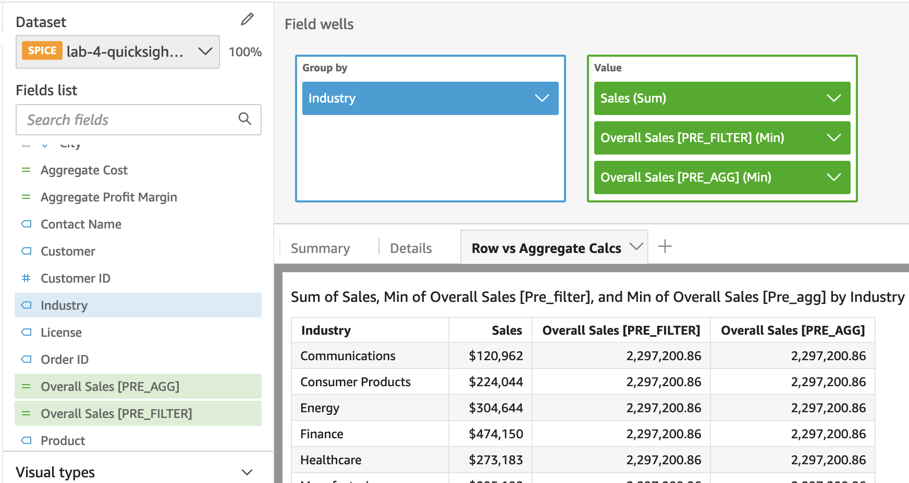
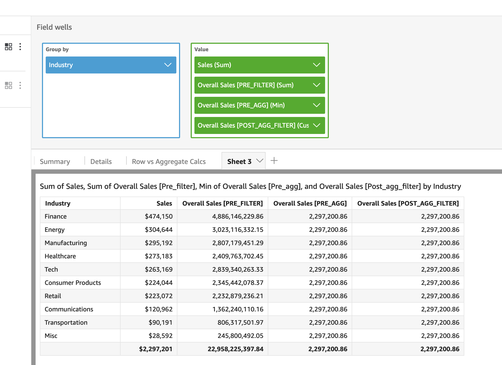

## Additive Calculation

Let add calculated field with name

```
Row Cost
```

The calculation

```
{Sales} - {Profit}
```

Similar with another name

```
Aggregate Cost
```

and calculation

```
sum({Sales}) - sum({Profit})
```



## Non-Additive Calculation

Let calculate profile margin which is non-additive. In this case, we have to aggegrate first then calculate the profile margin

Name

```
Row Profit Margin (Incorrect)
```

Calculation

```
{Profit}/{Sales}
```

Name

```
Aggregate Profit Margin
```

Calculation

```
sum({Profit})/sum({Sales})
```



## Level-Aware Calculation (Window)

Explain three columns get the same total

- LAC-W syntax with blank means group by lowest level [HERE]()

```
sumOver(Sales,[],PRE_FILTER)
sumOver(Sales,[],PRE_AGG)
sumOver(sum(Sales),[],POST_AGG_FILTER)
```

> Note - Second argument in the above calculation is the partition level. As we left the square brackets empty, the calculation will be done across the entire dataset.



## Level-Aware Calculation (Window)

Explain Oversales [Pre_filter] highly inflated due to [HERE](https://catalog.workshops.aws/quicksight/en-US/author-workshop/5-calculations/exercises)

- Sum all rows first time
- Sum group by second time

> The sumOver calculations we used so far are window functions. Their values are persisted at row level in your dataset. If you check the value field well of the table, you will see min applied as aggregate for the PRE_FILTER and PRE_AGG variants and Custom for POST_AGG_FILTER. If you change the aggregate for PRE_AGG / PRE_FILTER variants to sum, you will see highly inflated numbers as the total value present in each row is again getting summed up.
> So, in cases wherein you want to apply multiple levels of aggregations, you can use LAC variants of standard aggregate functions (referred to as LAC-A functions)

For example, 2127 by 2,297,201 = 4,886,146,527



## Level-Aware Calculation (Window)

- Create table to compare
- Add filter on Industry field and exclude Misc
- Add top 5 filter by sales
- Compare result between PRE_FILTER, PRE_AGG

Columns

```
Industry, Sales, Overall Sales [PRE_FILTER], Overall Sales [PRE_AGG], Overall Sales [POST_AGG_FILTER]
```

## Reference

- [QuickSight Workshop](https://catalog.workshops.aws/quicksight/en-US/author-workshop/5-calculations/exercises)
